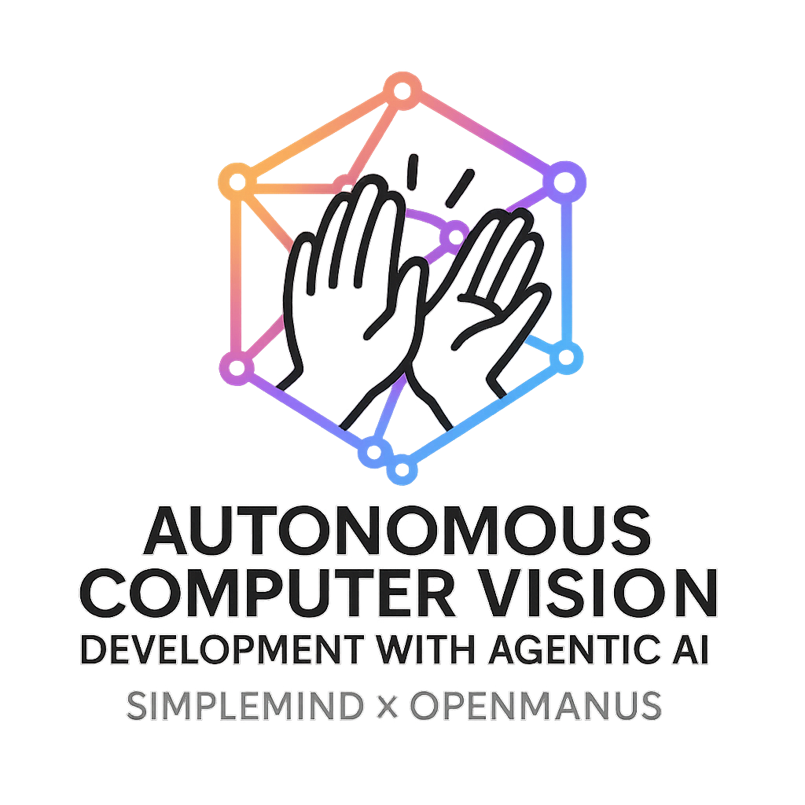
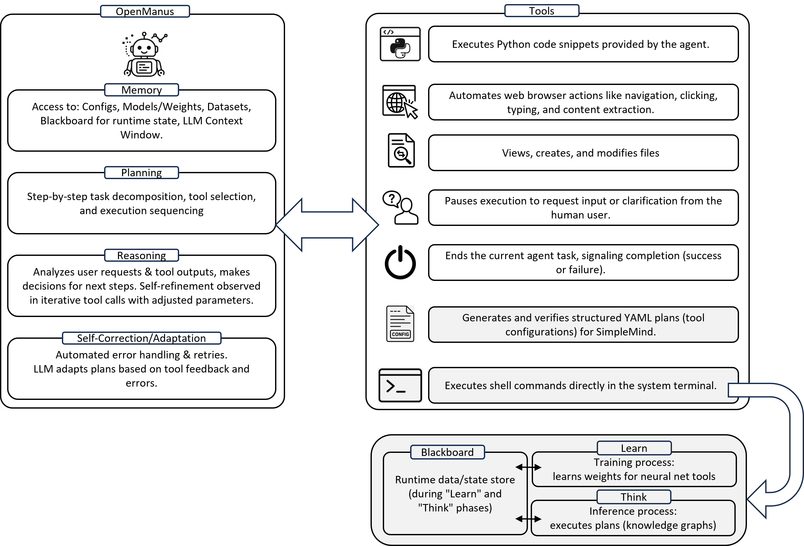
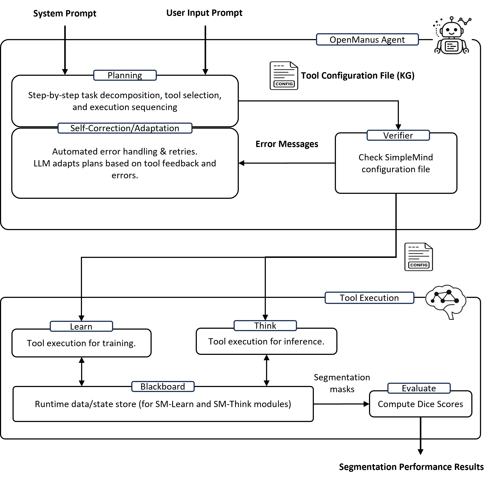

<p align="center">
  
  </p>

[](https://github.com/[YOUR_GITHUB_USERNAME]/[YOUR_REPO_NAME]/stargazers)
&ensp;
[](https://opensource.org/licenses/MIT) &ensp;
# 👋 Autonomous Computer Vision Development with Agentic AI (using OpenManus)

This project leverages and extends the capabilities of the OpenManus agentic framework to enable **Autonomous Computer Vision Development**. Our work focuses on demonstrating how an LLM-based agent, implemented using OpenManus, can automate the complex planning and tool configuration typically performed by a data scientist in the development of computer vision applications, specifically within the [SimpleMind Cognitive AI environment](https://gitlab.com/sm-ai-team/simplemind).

**Please Note:** We are an independent research team building upon the excellent foundation of the original OpenManus project. For information on the core OpenManus framework and its general installation, please refer to the [original OpenManus repository](https://github.com/mannaandpoem/OpenManus). This README focuses on our specific application and extensions.

Our team members include: Jin, Wasil, Sangyun, Shawn, John, and Matt. We welcome suggestions, contributions, and feedback on our work!

## Our Focus: Automating CV with Agentic AI

Agentic Artificial Intelligence (AI) systems, particularly those powered by Large Language Models (LLMs), are showing remarkable potential for complex reasoning, planning, and tool utilization. Our project demonstrates that a specialized computer vision system can be built autonomously from a natural language prompt using these Agentic AI methods.

**Key Objectives and Contributions:**

* **Automated CV Workflow Generation:** We extended [SimpleMind (SM)](https://gitlab.com/sm-ai-team/simplemind), an open-source Cognitive AI environment with configurable tools for medical image analysis, by integrating an LLM-based agent.
* **OpenManus for Agent Implementation:** The intelligent agent responsible for planning and task execution is implemented using the OpenManus framework (this version/fork).
* **Natural Language to CV Plan:** Our system can interpret a high-level computer vision task described in natural language (e.g., "provide sm (SimpleMind) config for lungs, heart, and ribs segmentation for cxr (chest x-ray)").
* **Autonomous Planning and Configuration:** The agent decomposes the task, selects appropriate tools from SimpleMind's library, and generates the necessary configuration file (a SimpleMind Knowledge Graph in YAML format) to execute the CV pipeline.
* **End-to-End Automation:** The agent autonomously triggers the training (SM-Learn) and inference (SM-Think) scripts within the SimpleMind environment using the generated configuration.

### Conceptual Workflow

The overall process involves:
1.  **User Prompt:** The user provides a natural language description of the CV task.
2.  **Agentic AI Planning (OpenManus + LLM):**
    * The LLM agent reasons about the request.
    * It plans the necessary steps (e.g., image loading, preprocessing, neural network inference, post-processing).
    * It selects and parameterizes SimpleMind tools.
    * It generates a SimpleMind Knowledge Graph (YAML).
3.  **Execution (SimpleMind):**
    * The agent initiates SimpleMind's SM-Learn module to train models using the generated YAML.
    * It then initiates SimpleMind's SM-Think module to run inference on new data.



### Proof-of-Concept: Chest X-Ray Segmentation

We successfully demonstrated this autonomous system with a chest x-ray segmentation task:
* **Input Prompt:** `"provide sm (SimpleMind) config for lungs, heart, and ribs segmentation for cxr (chest x-ray)"` (followed by execution commands).
* **Automated Actions:** The agent automatically:
    1.  Generated a valid SimpleMind YAML configuration.
    2.  Executed the `train_agents.sh` script in SimpleMind.
    3.  Executed the `think.sh` script in SimpleMind.
* **Results:** The autonomously configured, trained, and tested system achieved mean Dice similarity coefficients of:
    * **Lungs:** 0.96 (on 50 test images)
    * **Heart:** 0.82 (on 49 test images)
    * **Ribs:** 0.83 (on 50 test images)

This work highlights the potential for agentic systems to significantly streamline and automate the development of computer vision applications.

## System Architecture

Our system integrates the OpenManus agentic AI framework with the SimpleMind cognitive AI environment. The OpenManus agent, powered by an LLM (e.g., served via vLLM), handles task understanding, planning, and generation of the SimpleMind Knowledge Graph (YAML). SimpleMind then executes the defined computer vision pipeline.



## Installation

This project builds upon the OpenManus framework and integrates with SimpleMind and vLLM for efficient LLM serving.

1.  **Base OpenManus Installation:**
    For the fundamental setup of the OpenManus agent environment, please refer to the installation instructions in the [original OpenManus repository](https://github.com/mannaandpoem/OpenManus#installation).

2.  **Project-Specific Setup:**
    This project requires additional components and configurations:
    * **SimpleMind:** You will need to install SimpleMind. For installation instructions, please refer to [its official repository](https://gitlab.com/sm-ai-team/simplemind).
    * **vLLM:** For efficient Large Language Model serving, this project utilizes vLLM. Please install it by following the instructions on the [vLLM project documentation](https://docs.vllm.ai/en/latest/getting_started/installation.html) or their [GitHub repository](https://github.com/vllm-project/vllm).


<!-- 3.  **Browser Automation Tool (Optional, inherited from OpenManus):**
    If your specific workflows require browser automation:
    ```bash
    playwright install
    ``` -->

## Configuration

1.  **LLM Configuration (OpenManus):**
    Configure your LLM API keys and settings by creating a `config/config.toml` file. You can copy the example:
    ```bash
    cp config/config.example.toml config/config.toml
    ```
    Edit `config/config.toml` with your details, as described in the [original OpenManus documentation](https://github.com/mannaandpoem/OpenManus#configuration).

2.  **Project-Specific Configuration:**
    Ensure all paths for SimpleMind, datasets, and output directories are correctly set as per the instructions in [Our Project Setup Guide](./docs/PROJECT_SETUP.md) and any scripts or configuration files specific to this project.

## Quick Start / Running Our Demo

To run the autonomous chest X-ray segmentation demo described in our work:

1.  **Activate your Python environment** where OpenManus and SimpleMind are installed.
2.  **Launch the OpenManus agent:**
    ```bash
    python main.py
    ```
3.  **Provide the multi-step prompt** via the terminal when prompted by the agent. Based on our manuscript, an example interaction would be:

    **User Input (Step 1 - Configuration Generation):**
    ```
    Provide sm config for lungs, heart, and ribs segmentation for cxr
    ```
    *(The agent will then use its tools, potentially including an internal `sm_json_generator_and_verifier` as described in your manuscript's Table 1, to generate the `example.yaml` for SimpleMind.)*

    **User Input (Step 2 - Training):**
    *(Once the agent confirms YAML generation or you are ready to proceed)*
    ```
    Using terminal, Command "export gpu_num='0' && cd /path/to/your/simplemind && simplemind/example/train_agents.sh simplemind/example/example.yaml > simplemind/example/learn_output.txt"
    ```
    *(Replace `/path/to/your/simplemind` with the actual path to your SimpleMind directory where `train_agents.sh` and `example.yaml` are accessible.)*

    **User Input (Step 3 - Inference):**
    *(After training completes)*
    ```
    Using terminal, Command "export gpu_num='' && cd /path/to/your/simplemind && sh simplemind/example/think.sh > simplemind/example/think_output.txt"
    ```
    *(Ensure paths are correct. The agent will execute these terminal commands.)*

The agent will then process these requests, generate the SimpleMind configuration, and execute the training and inference scripts. Outputs and logs will be generated as specified (e.g., `learn_output.txt`, `think_output.txt`, and segmentation results from SimpleMind).

## How to Contribute

We welcome friendly suggestions and helpful contributions to *this specific project*! Please feel free to open issues or submit pull requests to this repository.

For discussions or questions related to our work on autonomous CV with OpenManus and SimpleMind, you can contact:
* [Primary Contact Name/Email or GitHub Handle] **Note**: If you plan to contribute code, please consider using a pre-commit tool to check your changes if this project adopts it. (e.g., `pre-commit run --all-files`).

## Community

For discussions related to the core OpenManus framework, please refer to the community channels of the [original OpenManus project](https://github.com/mannaandpoem/OpenManus).

<!-- ## Star History

[](https://star-history.com/#[YOUR_GITHUB_USERNAME]/[YOUR_REPO_NAME]&Date) -->
<!-- 
## Sponsors

Special thanks to any institutions or individuals supporting this work. -->

## Acknowledgements

This work builds upon several pioneering projects and tools. We gratefully acknowledge:

* The **OpenManus Team** ([@mannaandpoem](https://github.com/mannaandpoem) and other contributors) for creating the [OpenManus framework](https://github.com/mannaandpoem/OpenManus), which provided the foundational agentic capabilities for our project.
* The **SimpleMind Team** for developing the [SimpleMind Cognitive AI environment](https://gitlab.com/sm-ai-team/simplemind).
<!-- * Inspirations from [anthropic-computer-use](https://github.com/anthropics/anthropic-quickstarts/tree/main/computer-use-demo) and [browser-use](https://github.com/browser-use/browser-use).
* Related and inspiring works such as [AAAJ](https://github.com/metauto-ai/agent-as-a-judge), [MetaGPT](https://github.com/geekan/MetaGPT), [OpenHands](https://github.com/All-Hands-AI/OpenHands), and [SWE-agent](https://github.com/SWE-agent/SWE-agent). -->


## Our Publication

Our work, "Autonomous Computer Vision Development with Agentic AI," is detailed in our upcoming paper.
[placeholder]
<!-- 
* **Title:** Autonomous Computer Vision Development with Agentic AI
* **Authors:** Jin, Wasil, Sangyun, Shawn, John, Matt
* **arXiv Link:** [To be added once available]
* **Full BibTeX:**
    ```bibtex
    @article{[YOUR_ARXIV_ID_OR_CUSTOM_KEY_2025],
      author    = {Jin, [First Name] and Wasil, [First Name] and Sangyun, [First Name] and Shawn, [First Name] and John, [First Name] and Matt, [First Name]},
      title     = {Autonomous Computer Vision Development with Agentic AI},
      journal   = {arXiv preprint arXiv:[YOUR_ARXIV_NUMBER_ONCE_AVAILABLE]},
      year      = {2025}
      % month, pages, etc.
    }
    ```
    *(Please update the BibTeX with full author names and the correct arXiv details when available.)*
 -->

<!-- ## Cite Our Work

If you use our specific contributions to autonomous computer vision development, our SimpleMind integration, or the findings from our paper, please cite:
```bibtex
@article{[YOUR_ARXIV_ID_OR_CUSTOM_KEY_2025],
  author    = {Jin, [First Name] and Wasil, [First Name] and Sangyun, [First Name] and Shawn, [First Name] and John, [First Name] and Matt, [First Name]},
  title     = {Autonomous Computer Vision Development with Agentic AI},
  journal   = {arXiv preprint arXiv:[YOUR_ARXIV_NUMBER_ONCE_AVAILABLE]},
  year      = {2025}
  % Add other details like month, eprint, primaryClass when available
} -->
